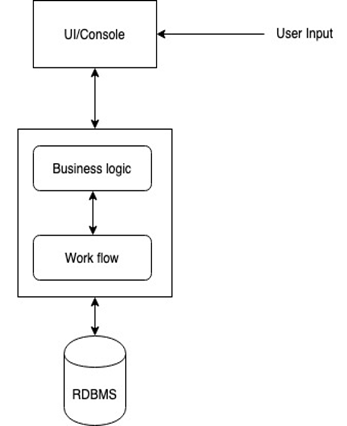
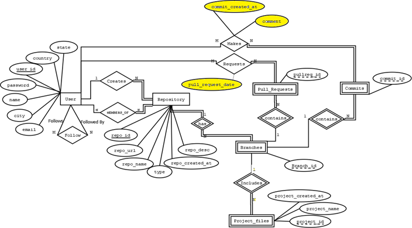
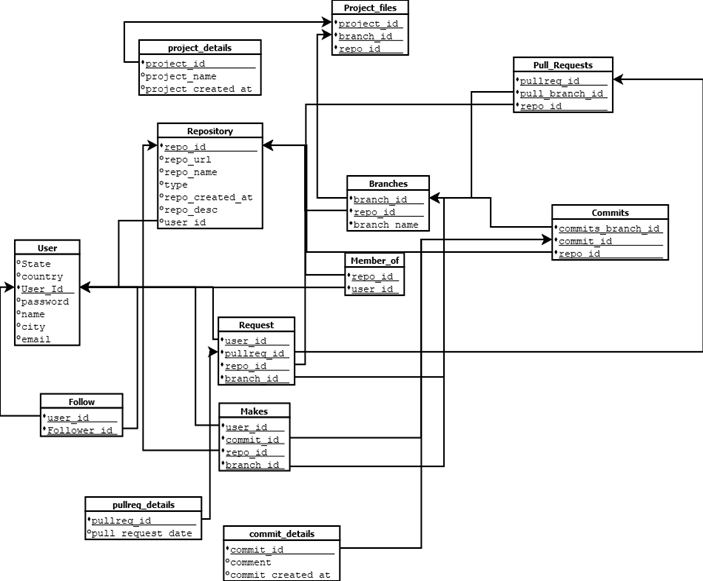
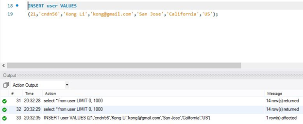
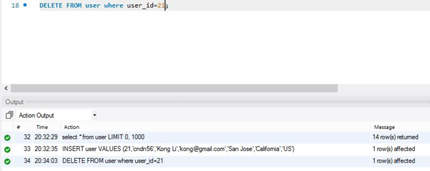
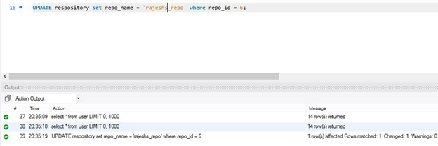
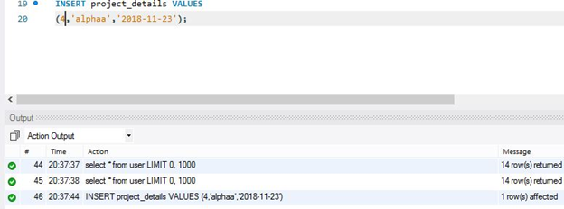
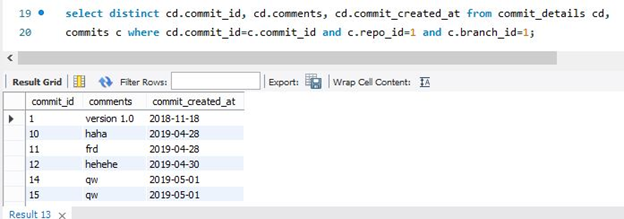
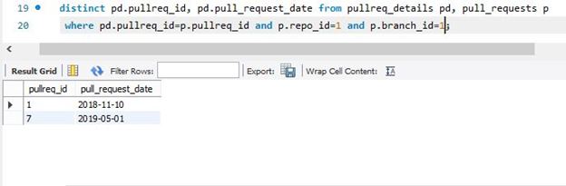

# Github_Clone
<h2><u>Table of Contents</u></h2>

<table>
	<tr>
		<th>Topic</th>
	</tr>
	<tr>
		<td>1.Choice of Database project</td>
	</tr>
	<tr>
		<td>2.Architecture Block Diagram</td>
	</tr>
	<tr>
		<td>3.Functionalities</td>
	</tr>
	<tr>
		<td>4.ER Diagram</td>
	</tr>
	<tr>
		<td>5.Specification of each DB object and its meaning</td>
	</tr>
	<tr>
		<td>6.Functionality dependencies</td>
	</tr>
	<tr>
		<td>7.Schema Diagram</td>
	</tr>
	<tr>
		<td>8.Normalization</td>
	</tr>
	<tr>
		<td>9.Screenshots of Major operations</td>
	</tr>
	<tr>
		<td>10.Test cases</td>
	</tr>
</table>

<h2><u>1. Choice of Database project: </u></h2>

This application is a version control tool for coder and developer. Here, people can come together and work on a same project individually. They will be able to make edits for the code that has been shared. When they finished their edit, they can merge all the version into one.

	Many times, it happens that the programmer wants to revert to a change he made. GitHub makes this possible by providing a feature called commits. Here a commit is done whenever some changes are made which can be accessed later.Coders can also follow each other and can be inspired by others work. They can post their projects which can be accessed by everyone.

	In this application, MySQL is used as Database engine. JDBC, JAVA, Log 4J are database application technologies. However, there will be no frameworks will be used in the project. Besides, Java is the only programming language, and JDBC 6.0 is the database access technology.

<h2><u>2. Architecture Block diagram:</u></h2>
	

	
	
Figure1:  Architecture Block Diagram of the project

<h2><u>3.Functionalities</u></h2>
<ol>
	<li>SignUp /Save the hashed password </li>
	
A user can sign up for a Github account with a password that will be encrypted while submitting the form.

	<li>Login /Decrypt the password</li>
	
A user logs in to his account with his password to access his data(repository). In this process, user credentials are encrypted and validated with the database hashed password.

	<li>Create a repository  / View all repository</li>
	
A user can create a repository where he can create number of branches and can store his project files.  

	<li>Create a branch / View all branches</li>
	
The repository members can create as many branches of the repository as he wants. Usually, each repository member is assigned a branch. The code in each branch is separate and so all members can work on same project without editing each other’s work.

	<li>Create a project file / View all projects for a branch</li>
	
Each repository has project files, which may contain the project related files and source code. 

	<li>Select a branch </li>
	<ul>
		<li>Commit in a branch /View all commits for that branch users can commit their works into the branch every time they add a new file. If the user wants to revert to a change he made and also can add code, GitHub makes this possible under this feature.</li>
		<li>
			Pull_request from a branch /View all pull_requests for that branch. Users can request to pull the data to their system by this feature.
		</li>
		<li>Comments in that branch /View all comments for that branch. Users who commit to the branch with a comment of changes they made.</li>
	</ul>
	<li>Follow Someone /View all the followers</li>
	
Each user can follow one or more users, and they can view their project files. Each user can see the list of people following them. 

	<li>Logout</li>
	
User after logging out of the account, gets reverted back to the login page.

</ol>
<h2><u>4.ER Diagram</u></h2>

	
	
Figure2: ER Diagram with changes highlighted
	

<h2><u>5.Specification of each DB object and its meaning:</u></h2>

User: This entity to store user information such as name, city, email, password, country, state, user_id. Each user has their unique id when they create an account.

Repository: This entity has create and member_of relationship with user entity. The create relationship allow user to create repositories and the user can be a member of multiple repositories.

Branches: It is an entity that depends on Repository entity, This entity allow users to create as many branches in the repository as they wish and related branches can be belong to only belong to a specific Repository entity. Each branch has their unique branch id. These branch_id can be duplicate for different repository.

Project_files: It is an entity that depends on branches entity and Repository entity. This allow users share their their project files. The project_files entity has project_created_at, project_name, and unique project_id attributes. Project_id can be duplicated among other project_id in different branches.

Pull_Request: It is an entity that is not only depends on users entity but also branches. The user send a request for pull_request. Each pull request entity can have a unique pullreq_id. Pullreq_id can be duplicate in different branches.

Commit: It is an entity that allow user to commit their changes into branches. Each commit has unique commit_id, and commit_id can be duplicated in different branches.

<h2><u>6.Functionality dependencies:</u></h2>
<strong>Users:</strong>
<table>
	<tr>
		<td>User_ID</td>
		<td>password</td>
		<td>name</td>
		<td>email</td>
		<td>city</td>
		<td>state</td>
		<td>country</td>
	</tr>
</table>

User ID → {password, name, email, city, state, country

<strong>Repository:</strong>
<table>
	<tr>
		<td>User_ID</td>
		<td>Repo_ID</td>
		<td>repo _URL</td>
		<td>repo_name</td>
		<td>repo_desc</td>
		<td>repo_created_at</td>
	</tr>
</table>

User ID, Repo ID → {repo_eurl, repo_name, type, repo_desc, repo_created_at}

<strong>Branches:</strong>
<table>
	<tr>
		<td>Repo_ID</td>
		<td>Branch_ID</td>
		<td>Branch_name</td>
	</tr>
</table>

Repo ID, Branch ID → { branch_name}

<strong>Project_files:</strong>
<table>
	<tr>
		<td>Repo_ID</td>
		<td>Branch_ID</td>
		<td>Project_ID</td>
		<td>Project_name</td>
		<td>Project_created_at</td>
	</tr>
</table>

Repo_ID,  branch_ID, project_ID → { project name, project created at}

<strong>Makes</strong>
<table>
	<tr>
		<td>User_ID</td>
		<td>Repo_ID</td>
		<td>Branch_ID</td>
		<td>Commit_ID</td>
		<td>Comment</td>
		<td>Commit_created_at</td>
	</tr>
</table>

User_ID,  Repo_ID, Branch_ID, Commit_ID → {comment, commit_created_at}

<strong>Requests:</strong>
<table>
	<tr>
		<td>User_ID</td>
		<td>Repo_ID</td>
		<td>Branch_ID</td>
		<td>Pull_req_ID</td>
		<td>pull_req_date</td>
	</tr>
</table>

User_ID, Repo_ID, Branch_ID, Pull_req_ID → { pull_req_date}

<h2><u>7.Schema Diagram:</u></h2>

	
	
Figure3: Schema Diagram of Database
	

<h2><u>8.Normalization</u></h2>
<ol>
	<li>1. user: user_id(pk), password, name, email, city, state, country</li>
	
The table has one primary key which is user_id, User ID → {password, name, email, city, state, country}, and  there is no multivalued attributes or nested relation. Thus, this table is 1st normal form(NF). The table is also in 2nd normal form because it is 1NF and there is no partial dependency in the table. The table is 3rd normal form because it is 2NF and the attributes has no transitive dependencies.

	<li>followers(user_id , follower)</li>
	
This table contains only composite primary key so it is the 1st NF. Since it is 1st NF, and there is no partial dependencies so it is 2nd NF. Lastly, the table is also 3rd NF because it is 2nd NF and it has no transitive dependencies

	<li>Repository (user_id, repo_id(pk), repo_url,repo_name, repo_desc, repo_created_at)</li>
	
This table has user_id as the foreign key and repo_id as primary key, repo_id->{ user_id, repo_url,repo_name, type, repo_desc, repo_created_at}, and there is no multivalued attributes or nested relation. Therefore, this is the 1st NF. Since it is 1st NF, and there is no partial dependencies so it is 2nd NF. The table is also 3rd NF because table is 2nd NF and it is fully dependencies with no transitive dependencies

	<li>Members_of:(user_id(pk), repo_id(pk))</li>
	
This table has two composite primary key which is the same as followers table. Thus, it is 3rd NF.

	<li>branches (repo_id, branch_id, branch_name)</li>
	
This table also has two composite primary key which are repo_id (foreign key) and branch_id, and there is no multivalued or nested relation. Hence, it is the 1st NF. The table is also 2nd NF because it is 1st NF and branch name depends on both repo_id and branch_id so it is 2nd NF. The table is 2nd NF, branch_name attribute fully depends on both composite primary key, and there is no transitive dependencies. Thus, it is the 3rd NF.

	<li>Project_files (repo_id,  branch_id, project_id, project_name, project_created_at)</li>
	
BREAKS DOWN TO 
	(
	project_files: repo_id,  branch_id, project_id
	project_details: project_id, project_name, project_created_at
	)

	

	The project_files has three composite primary key which are repo_id(foreign key), branch_id, and project_id. The project_file table has no multivalued attributes or nested relation. Thus, project_file table is 1st NF. This table is 1st NF , and project_name and project_created_at are depend on all three primary keys. Thus, it is 2NF. However, these attributes have transitive dependencies. Therefore, it is necessary to break down the table into 2 sub tables which are project_files and project_details. In the project_file table, the schema remains same with three composite primary key (repo_id, branch_id, and project_id) since this table contains only three primary so it is 3rd NF. In the project_details schema, it has only project_id as primary key, and there are no multivalued or composite attributes. Thus this table is 1st NF, and the project_name and project_created_at depends only on prject_id. Hence, it is 2nd NF. Because this table is 2nd NF, and these attributes is fully depends on primary key and there is no transitive dependencies. As a result, project_details schema is also in 3rd NF
	

	<li>makes: user_id,  repo_id, branch_id, commit_id, comment, commit_created_at</li>
	
BREAKS DOWN TO 
	(
	makes: user_id,  repo_id, branch_id, commit_id
	commit_details: commit_id, comment, commit_created_at
	)
	

	

		Makes schema has the same problem as project_file schema since the schema is 1st NF because it has four composite primary keys and there is no multivalued attributes and nested relation. Makes schema qualify for 1st NF relation, and  the attributes depends on the composite primary key in the makes schema. Thus, it is 2 NF. However, the makes schema is not fully dependencies. makes is broken down into two schema which are makes and commit_details. The makes schema keep all the primary from original schema, and the table has no attributes. Thus, it is 3rd NF. For the commit_details schema, it has one commit_id primary key, and the attributes are not multivalued attributes and no nested relation. Hence, it is 1st NF, and these attributes depends only on commit_id primary key. Thus, it is 2nd NF. The schema is 2nd NF, and there is no transitive dependencies in this table which means comment and commit_created_at are both directly depend on commit_id. As a result, it is 3rd NF.
	

	<li>requests: user_id, repo_id, branch_id, pullreq_id, pull_request_date</li>
	
BREAKS DOWN TO 
	(
	requests: user_id, repo_id, branch_id, pullreq_id
	pullreq_details: pullreq_id, pull_request_date
	)
	

	
Requests schema has four composite primary keys and there is no multivalued attribute or nested relation. Thus ,it is 1st NF. The requests schema is 2nd NF because it first satisfied 1NF and pull_request_date depends only on three primary key. Nevertheless, the requests schema is not fully dependencies and they are transitive dependencies. Eventually, the schema is broken into two part requests and pullreq_details. Since requests schema only contains four composite primary key. Therefore it is in 3rd NF. The pullreq_details schema has pullreq_id primary key, and pull_request_date is not a multivalued attribute or relation schema. Therefore, pullreq_details schema is 1NF. Pullreq_details is 1NF, and pull_request_date depends only on pullreq_id. Therefore, it is 2NF. The pullreq_details is 2NF and there is no transitive dependencies. Thus, it is also 3NF schema.

	<li>commits: repo_id, branch_id, commit_id</li>
	

		Commits contains 3 composite primary keys. There is no multivalued attributes or nested relation. Thus, it is 1NF. Besides, there are only primary key so there is no partial dependencies in the table, Thus it is 2NF. In addition, there are only three primary key so it is full dependencies
	

	<li>10.	pull_requests: repo_id, branch_id, pullreq_id</li>
	

		Pull_requests schema has 3 composite primary keys. There is no multivalued attributes or nested relation. Thus, it is 1NF. Moreover, there is no partial dependencies in the table. Thus it is 2NF. In addition, shema is fully dependencies. Hence, it is 3NF.
	

</ol>
<h2><u>9.Screenshots of Major operations:</u></h2>

	
Insert into User query

	
	
Delete from user query

	
	
Update repository name query

	
	
Insert project details query

	
	
View Commits query

	
	
View Pull requests query

	

<h2><u>10.Test cases:</u></h2>
<a href="./Test_cases.xlsx"> Test case file</a>